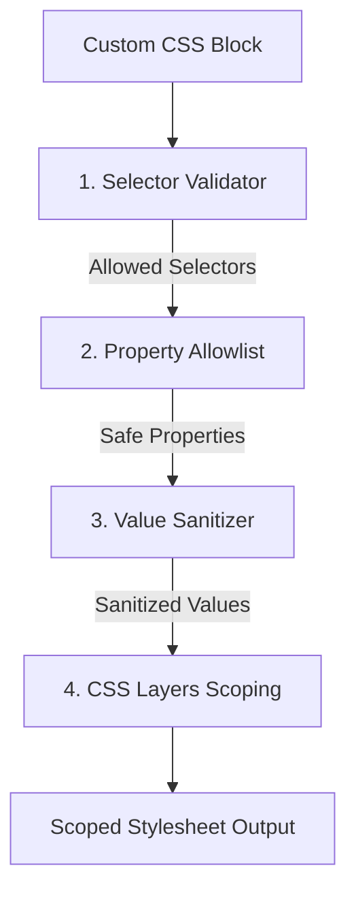

# CSS Styling Engine & Theme System (DSL v2.1)

Amana compiles styling declarations into high-performance, scoped, and RTL-compliant CSS rules. The styling system enforces architectural safety while providing deep support for custom animations, gradients, and typography scales.

---

## 🎨 Global Theme Configuration

Global visual variables are configured under the top-level `theme:` block in the entry `.amana` file:

```amana
theme:
    mode: dark
    direction: ltr
    language: en
    font_provider: google
    font_family: "Space Mono"
    heading_font_family: "Orbitron"
    arabic_font_family: "Noto Sans Arabic"
    primary: "#10b981"
    accent: "#ff007f"
    canvas: "#020813"
    base: "#0b0e17"
    elevated: "#121724"
    text: "#ffffff"
    muted: "#8b949e"
    border: "#202538"
    radius: soft
    surface: glass
    density: comfortable
    gradient_hero: "linear-gradient(135deg, #05070f 0%, #121724 100%)"
```

### Supported Keys:
- `mode`: Fallback rendering mode (`light`, `dark`, `day`, `night`).
- `direction`: Script layout orientation (`ltr` or `rtl`).
- `language`: Target locale code (e.g. `ar` or `en`).
- `font_provider`: Provider endpoint (`google` or `system`).
- `font_family`, `heading_font_family`, `arabic_font_family`: Font name declarations. The engine loads Google Fonts automatically if `font_provider: google` is active.
- `primary`, `accent`: Primary visual identity coloring.
- `canvas`, `base`, `elevated`, `text`, `muted`, `border`: UI system colors.
- `radius`: Standard element curve scale alias (`sm` through `2xl`).
- `surface`: Backdrop layers styling layout (`glass`, `elevated`, `flat`, etc.).
- `density`: Global layout density margins (`compact`, `comfortable`, `spacious`).
- `gradient_hero`: Hero section layout linear/radial background gradient definitions.

---

## 🔁 Logical Properties & RTL/LTR Mirroring

Amana guarantees pixel-perfect layout mirroring when switching text directions:

### 1. Logical Properties Mappings
Instead of compiling physical properties (like `margin-left` or `padding-right`), the Amana compiler automatically rewrites rules to **CSS Logical Properties**:
- `margin-left` compiles to `margin-inline-start`.
- `margin-right` compiles to `margin-inline-end`.
- `padding-left` compiles to `padding-inline-start`.
- `padding-right` compiles to `padding-inline-end`.
- `left: 0` compiles to `inset-inline-start: 0`.
- `right: 0` compiles to `inset-inline-end: 0`.

### 2. Direction-Aware Alignments
Flexbox and Grid layout properties are dynamically mirrored based on theme configuration:
- Horizontal alignments like `flex-start` and `flex-end` align relative to the reading origin (`inline-start` / `inline-end`).
- Flex columns change flow axes without breaking child node distribution.
- **RTL Arabic Fonts**: If `direction: rtl` or `language: ar` is configured, the compiler prioritizes `arabic_font_family` in the CSS font stack for clean glyph rendering.

---

## 📏 Design Token Scale Systems

Amana populates root custom variables (`var(--token-name)`) to guarantee visual consistency:

### 1. Spacing Scale (`--space-*`)
Controls grid margins, section paddings, and card gaps:
- `--space-xs`: `0.25rem` (4px)
- `--space-sm`: `0.5rem` (8px)
- `--space-md`: `1rem` (16px) - *adjusts dynamically based on density*
- `--space-lg`: `1.5rem` (24px) - *adjusts dynamically based on density*
- `--space-xl`: `2rem` (32px) - *adjusts dynamically based on density*
- `--space-2xl`: `3rem` (48px)
- `--space-3xl`: `4.5rem` (72px)
- `--space-4xl`: `6rem` (96px)

### 2. Typographic Size Scale (`--text-*`)
- `--text-xs`: `0.75rem` (12px)
- `--text-sm`: `0.875rem` (14px)
- `--text-md`: `1rem` (16px)
- `--text-lg`: `1.125rem` (18px)
- `--text-xl`: `1.35rem` (21.6px)
- `--text-2xl`: `1.75rem` (28px)
- `--text-3xl`: `2.4rem` (38.4px)

### 3. Border Radius Scale (`--radius-*`)
- `--radius-sm`: `10px` (badges, tags, mini inputs)
- `--radius-md` / `--radius-soft`: `16px` (form fields, standard buttons)
- `--radius-lg` / `--radius-large`: `22px` (standard cards, timeline content blocks)
- `--radius-xl`: `28px` (large container grids, sidebars, dashboard shells)
- `--radius-2xl`: `36px` (hero sections, modals, overlay boards)

### 4. Elevation Depth Shadows (`--shadow-*`)
- `--shadow-sm`: Subtle inset border-glow.
- `--shadow-md` / `--shadow-soft`: Default cards shadow outline.
- `--shadow-lg`: Deep card float shadow.
- `--shadow-xl`: Main landing hero card shadows.
- `--shadow-smooth`: Ambient low-contrast blur shadow.
- `--shadow-floating`: High-depth shadow for modals and popups.
- `--shadow-strong`: Maximum overlay drop shadow.

---

## 🎨 Mesh Gradients

The `gradient: mesh` visual rule compiles into a premium, dynamic background gradient:

```css
background: radial-gradient(circle at 12% 8%, var(--color-primary-soft), transparent 30%), 
            radial-gradient(circle at 80% 90%, var(--color-accent-soft), transparent 35%), 
            var(--canvas-bg);
```

- Instead of hardcoded colors, it binds variables mapping back to the configured theme `primary` and `accent` options.
- Safely shifts colors automatically during light/dark theme toggle operations.

---

## 🛡️ 4-Layer CSS Scoped Sanitizer

To secure user interfaces and prevent style pollution, the compiler subjects all custom CSS style blocks to a 4-layer sanitizer validation:



### 1. Selector Safety Validator
Blocks attempts to style global document variables.
- **Rejected Selectors**: `body`, `html`, `*`, `script`, `iframe`, element tag selectors without scope.
- **Rejected Attributes**: Attribute selectors (like `[onclick]`) that present script execution vulnerabilities.

### 2. Property Safety Allowlist
Only allows safe layout, typography, borders, and painting declarations. Insecure layout hacks or hardware-tampering properties are rejected.

### 3. Value Sanitizer
Inspects property values for code injection sequences.
- **Rejected Values**: Strings containing `javascript:`, `expression(`, `behavior:`, `<script`, `</style`, `-moz-binding`, `binding:`.
- **URL Sanitization Rules**: 
  - Unquoted URL schema targets (`url(data:`, `url(http:`, `url(https:`) are strictly blocked by default to prevent malicious payload bindings or unapproved script/asset imports.
  - Quoted URLs (e.g., `url("https://...")` or `url('https://...')`) are **permitted** inside approved properties (like `background-image` or `background`) to allow safe loading of external image/media assets.

### 4. CSS Layers Scoping
- Custom styles are grouped inside `@layer components, variants, overrides` to resolve style conflicts cleanly.
- Selectors are automatically prepended with view or custom component scoping IDs to prevent styles from leaking to other views.

---

## ⚙️ Syntax Syntax Capabilities & Constraints

### 1. Multi-Line Grouped Selectors
CSS selector grouping separated by commas can span across multiple lines. The parser consumes trailing newlines automatically:
```amana
.telemetry-card,
.metrics-card,
.diagnostic-alert:
    margin-bottom: var(--space-xl)
```

### 2. Nesting Constraints
Because Amana uses a flat `selector: property-value` AST structure, **percentage blocks inside `@keyframes` or media blocks inside `@media` cannot be nested within `.amana` files**.
- Standard animations and responsive layouts must be declared using the design grammar configuration blocks (`motion:`, `responsive:`) which generate standard token styles natively.
