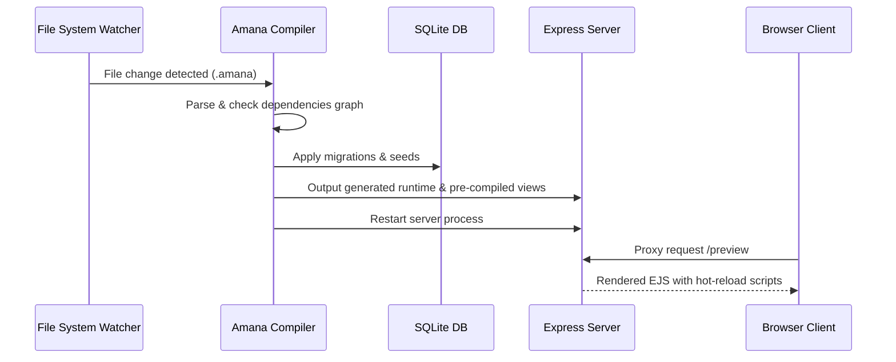

# Live Preview & Dev Server Architecture

Amana incorporates a hot-reloading development server that minimizes feedback loops during styling and feature design.

---

## 🏛️ Live Compile & Dev Flow Architecture

When executing `amana dev <entry-file.amana> [dist]`, the developer experience loop coordinates actions across file system observers, compiler engines, and runtime targets:



### 1. File Graph Observer
- The observer tracks all `.amana` files connected to the entrypoint via `import` statements.
- Modify and save action on any child module instantly triggers the compiler build cycle.

### 2. Migration & Seed Automation
- The dev engine compares model shifts against current schemas.
- It applies SQLite migrations without losing workspace context.
- Development seed records are written to keep data sets active.

### 3. Hot Restart & Proxy Routing
- The dev command starts the output Node.js Express server on an assigned port.
- If a build succeeds, the server is gracefully restarted.
- Visual elements are served directly via proxy endpoints.

---

## 🎨 Visual Hot-Reloading

EJS views pre-compiled in development mode include a client-side listener script.
- The script opens a WebSocket connection back to the Amana dev runner process.
- Upon receiving a reload signal, the browser automatically refreshes the active viewport.

---

## 🛠️ Design Auditing Loop

The recommended design feedback loop for developers using Amana is:

```text
Edit Source -> Compiler Lint (check --json) -> Format (fmt) -> Compile (build) -> Visual Review -> Adjust
```

1. **Static Validation**: Run `amana check --json` to verify design properties and values.
2. **Auto-Formatting**: Run `amana fmt` to normalize code.
3. **Build target**: Rebuild code and launch browser previews.
4. **Inspect Design**: Run `inspect-design` to audit score and coverage.
